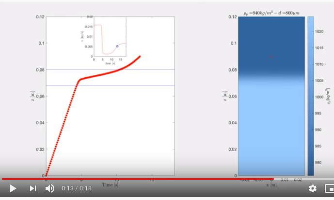

# Supplementary material for Verso et al. "Transient stratification force on particles crossing a density interface"

[](https://www.zenodo.org/badge/latestdoi/146497023)


[](https://www.youtube.com/watch?v=1-rRBhaeAd0 "Simulation of a particle crossing stratified interface - Click to watch on Youtube")


This repository contains the Matlab (Mathworks Inc.) and Octave (https://www.gnu.org/software/octave/) compatible code that models a trajectory of an inertial particle crossing the interface. 

There are 5 types of particles, P1-P4 measured in our experiment and PF digitized from the cited paper by Srdic-Mitrovic et al. 1989 https://doi.org/10.1017/S0022112098003590

To run the code open the file `particle.m`, change the value of `flag` from 1 to 5 and `Run`

## You can run it without installation using the Python version:
[](https://mybinder.org/v2/gh/alexlib/stratification_force_model/master?filepath=Python%2Fparticle.ipynb)

## How to cite this work:
The paper is at https://doi.org/10.1016/j.ijmultiphaseflow.2019.103109

Please cite it as: 
```
@article{Verso2019,
abstract = {We perform a series of experiments to measure Lagrangian trajectories of settling and rising particles as they traverse a density interface of thickness h using an index-matched water-salt-ethanol solution. The experiments confirm the substantial deceleration that particles experience as a result of the additional force exerted on the particle due to the sudden change in density. This stratification force is calculated from the measurement data for all particle trajectories. In absence of suitable parameterisations in the literature, a simple phenomenological model is developed which relies on parameterisations of the effective wake volume and recovery time scale. The model accurately predicts the particle trajectories obtained in our experiments and those of Srdi{\'{c}}-Mitrovi{\'{c}} et al. (1999). Furthermore, the model demonstrates that the problem depends on four key parameters, namely the entrance Reynolds number Re1, entrance Froude number Fr, particle to fluid density ratio $\rho$p/$\rho$f, and relative interface thickness h/a.},
author = {Verso, Lilly and van Reeuwijk, Maarten and Liberzon, Alexander},
doi = {https://doi.org/10.1016/j.ijmultiphaseflow.2019.103109},
issn = {0301-9322},
journal = {International Journal of Multiphase Flow},
keywords = { 3D-PTV, Density interface, Lagrangian trajectories, Stratification force,Inertial particles},
pages = {103109},
title = {{Transient stratification force on particles crossing a density interface}},
url = {http://www.sciencedirect.com/science/article/pii/S0301932219302162},
volume = {121},
year = {2019}
}
```


